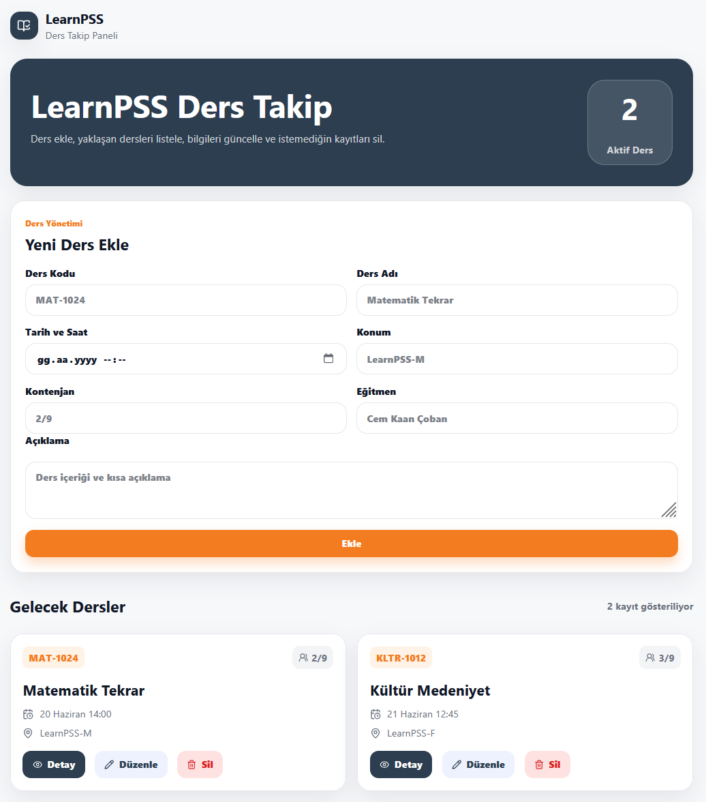

# LearnPSS Ders Takip Projesi

Bu proje JavaScript / React eğitimi kapsamında hazırlanmıştır. Projede basit bir ders takip uygulaması yapılmıştır. Kullanıcı ders ekleyebilir, eklediği dersleri listeleyebilir, ders bilgilerini düzenleyebilir ve silebilir.

Projede amaç React yapısını, component kullanımını, sayfa yapısını ve temel CRUD işlemlerini uygulamaktır. Veriler LocalStorage üzerinde tutulduğu için sayfa yenilendiğinde eklenen dersler kaybolmaz.

## Kullanılanlar

* ReactJS
* Vite
* JavaScript
* Tailwind CSS
* React Router DOM
* LocalStorage

## Özellikler

* Yeni ders ekleme
* Dersleri listeleme
* Ders düzenleme
* Ders silme
* Ders detayını görüntüleme
* LocalStorage ile veri saklama

## Klasör Yapısı

Projede dosyalar daha düzenli olması için klasörlere ayrılmıştır.

```text
src/
  components/
    CourseCard.jsx
    CourseForm.jsx
    Navbar.jsx

  pages/
    Home.jsx
    CourseDetail.jsx

  interfaces/
    CourseModel.js

  utils/
    localStorage.js

  App.jsx
  main.jsx
```

## Çalıştırma

Projeyi çalıştırmak için ilk olarak paketler kurulmalıdır.

```bash
npm install
```

Daha sonra proje aşağıdaki komutla başlatılır.

```bash
npm run dev
```

Proje çalıştıktan sonra tarayıcıda genellikle şu adresten açılır:

```text
http://localhost:5173/
```

## Proje Kullanımı

Ana sayfada ders ekleme formu ve ders listesi yer almaktadır. Form doldurulduktan sonra ekleme butonuna basıldığında yeni ders listeye eklenir.

Listelenen her dersin üzerinde detay, düzenle ve sil butonları bulunur. Düzenle butonu ile seçilen dersin bilgileri forma aktarılır ve güncellenebilir. Sil butonu ile ders listeden kaldırılır. Detay butonu ile dersin detay sayfasına gidilir.

## Ekran Görüntüsü



## Canlı Demo

learnpss.netlify.com
## Github Linki

https://github.com/esmauuid/learnpss-js-project
